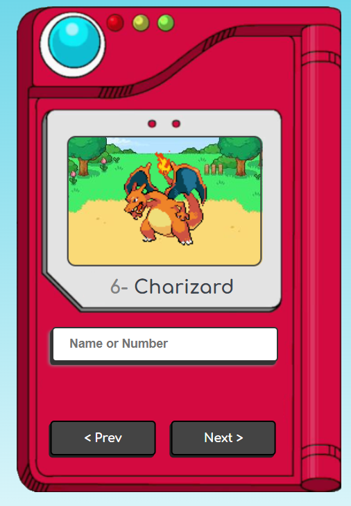

<h1>Pokedex</h1>

<h2 align='center'>Imagem do projeto</h2>



```
projeto finalizado
```

<h3>Para visitar o site clique:</h3>


>https://pokedex-xi-seven.vercel.app/

<hr>

<h2>Projeto desenvolvido com HTML, Css e JS em conjunto com canal Manual do Dev</h2>


Créditos: https://www.youtube.com/watch?v=SjtdH3dWLa8&t=1109s